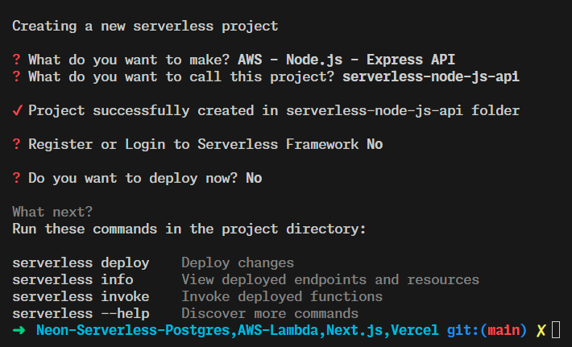

# SETUP

## install node js lts version

## install serverless framework

```bash
npm install -g serverless
```

## let's create a serverless project

```bash
serverless
```



since our application is serverless,node-postgres is not sutable for our application, so we will use our serverless database provider for this.

```bash
npm install @neondatabase/serverless
```

and we will also use neonctl to manage our database

```bash
npm install -g neonctl
```
