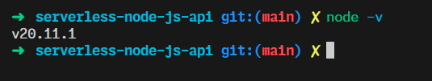
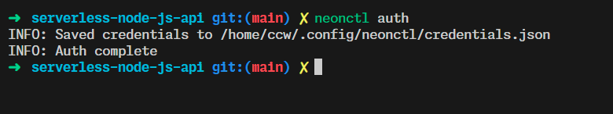
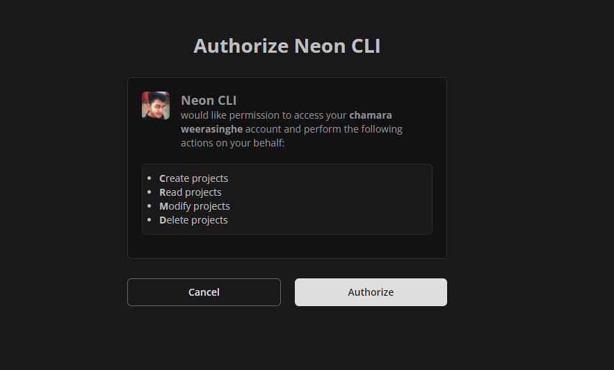
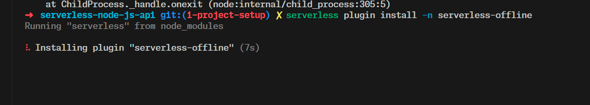
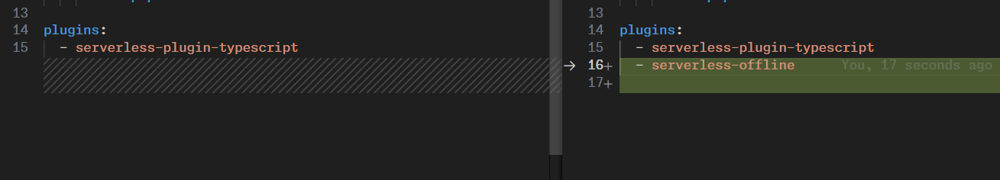
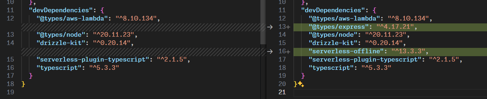

# SETUP

## install node js lts version

<https://nodejs.org/en/download/>

to check if node is installed

```bash
node -v
```



## install serverless framework

```bash
npm install -g serverless
```

## let's create a serverless project

```bash
serverless
```


since our application is serverless,node-postgres is not sutable for our application, so we will use our serverless database provider for this.

```bash
npm install @neondatabase/serverless
```

and we will also use neonctl to manage our database

```bash
npm install -g neonctl
```

let's authenticate our neon account

```bash
neonctl auth
```





as our ORM we will use drizzle, so let's install it

```bash
npm i drizzle-orm
```

we will also use drizzle-kit

<https://orm.drizzle.team/kit-docs/overview>

```bash
npm i -D drizzle-kit
```

<!-- let's add typescript to our project

```bash
npm i -D @types/aws-lambda typescript serverless-plugin-typescript @types/node @types/express
``` -->

if we are running the application in a server full environment.

```bash
node index.ts
```

but we are not so let's use the following command

```bash
serverless plugin install -n serverless-offline
```

this will add the serverless-offline plugin to devDependencies in package.json file as well as will add it to plugins in serverless.yml.

The command serverless plugin install -n serverless-offline is used to install a specific plugin for the Serverless framework. The -n option is used to specify the name of the plugin, which in this case is serverless-offline.

The serverless-offline plugin emulates AWS λ and API Gateway on your local machine to speed up your development cycles. To do so, it starts an HTTP server that handles the request's lifecycle like APIG does and invokes your handlers.



this will add




current serverless.yml file

```yaml
service: serverless-node-js-api
frameworkVersion: '3'

provider:
  name: aws
  runtime: nodejs18.x

functions:
  api:
    handler: index.handler
    events:
      - httpApi: '*'

plugins:
  - serverless-offline

```

let's add a script to our package.json file

```json
"scripts": {
    "start": "sls offline --stage dev"
  },
```

and move the application code to a folder called src

```bash
mkdir src
mv index.js src/index.js
```

amd change the handler in serverless.yml

```yaml
functions:
  api:
    handler: src/index.handler
    events:
      - httpApi: '*'
```

