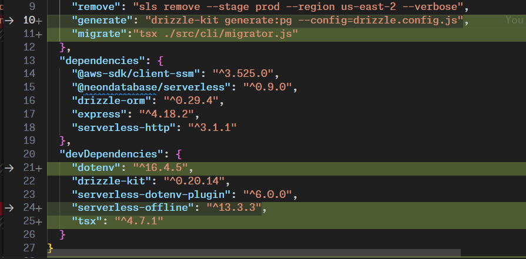

```bash
npm i -D tsx dotenv
```



let's create a migrator function that will be responsible for running the migrations. This function will be called from the CLI.

```javascript
// tsx src/cli/migrator.js
require('dotenv').config();
const schema = require('../db/schemas');
const { getDatabaseUrl } = require('../lib/secrets');
const { migrate } = require('drizzle-orm/postgres-js/migrator');
const { drizzle } = require('drizzle-orm/neon-serverless');
const { Pool, neonConfig } = require('@neondatabase/serverless');
const ws = require('ws');
async function performMigration() {

    const dbURL = await getDatabaseUrl();

    if (!dbURL) {
        throw new Error('Database URL not found');
    }
    neonConfig.webSocketConstructor = ws;
    // neon serverless pool
    const pool = new Pool({
        connectionString: dbURL
    });

    pool.on('error', (err, client) => {
        console.error('Unexpected error on idle client', err);
        process.exit(-1);
    });

    const client = await pool.connect();

    try {
        await client.query('BEGIN');

        const db = await drizzle(client, { schema });

        await migrate(db, {
            migrationsFolder: './src/migrations',
        });

        await client.query('COMMIT');

    } catch (error) {
        await client.query('ROLLBACK');
        throw error;
    } finally {
        client.release();
    }

    await pool.end();
}

if (require.main === module) {
    console.log('Running migrator');
    performMigration().then(() => {
        console.log('Migration complete');
        process.exit(0);
    }).catch((err) => {
        console.error(err);
        process.exit(1);
    });
}

```

let's run the migrator function

```bash
npm run migrate
```
