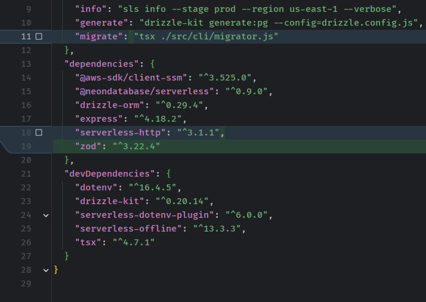

## ZOD

let's install zod

```bash
npm install zod
```



let's add a simple email validator

```javascript
const {z} = require('zod');


function emailValidator(request) {
    const schema = z.object({
        email: z.string().email(),
    });

    let message = '';
    let hasError = false;
    let errorMessage = "";

    try {
        const passed = schema.parse(request);
        return {
            hasError: false,
            message,
            data: passed
        };
    } catch (e) {
        hasError = true;
        errorMessage = e.errors[0].message;
        message = errorMessage;
        return {
            hasError,
            message,
            data: null
        };
    }

}

module.exports = {
    emailValidator
};
```

use it in the route

```javascript
app.post("/leads", async (req, res, next) => {
    const {email} = req.body;
    const {data, hasError, message} = emailValidator({email});
    if (hasError) {
        return res.status(400).json({
            error: message,
            data: null,
            hasError
        });
    }
    const savedLead = await newLead(data.email);
    return res.status(200).json({
        data: savedLead,
        hasError,
        message
    });
});
```