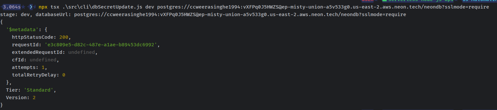
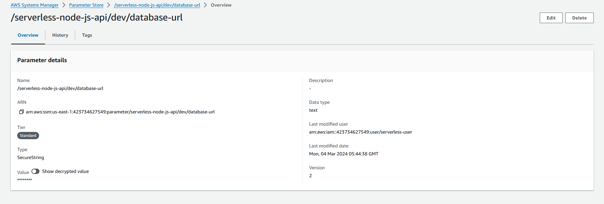

# AUTOMATING BRANCHED NEON DATABASE SECRETS

let's create a new function.

```javascript
const {SSMClient, GetParameterCommand, PutParameterCommand} = require("@aws-sdk/client-ssm");

const STAGE = process.env.STAGE;
const DATABASE_URL_SSM_PARAM = `/serverless-node-js-api/${STAGE}/database-url`;
const AWS_REGION = process.env.AWS_REGION;

async function getDatabaseUrl() {
    const client = new SSMClient({region: AWS_REGION});
    const parameterData = {Name: DATABASE_URL_SSM_PARAM, WithDecryption: true};
    const command = new GetParameterCommand(parameterData);
    const response = await client.send(command);
    return response.Parameter.Value;
}

async function putDatabaseUrl(stage, databaseUrl) {
    const paramStage = stage ? stage : "dev";

    if (paramStage === 'prod') {
        return;
    }

    const databaseUrlParam = `/serverless-node-js-api/${paramStage}/database-url`;

    const client = new SSMClient({region: AWS_REGION});
    const parameterData = {
        Name: databaseUrlParam,
        WithDecryption: true,
        Value: databaseUrl,
        Type: 'SecureString',
        Overwrite: true
    };
    const command = new PutParameterCommand(parameterData);
    return await client.send(command);
}

module.exports = {getDatabaseUrl, putDatabaseUrl};


```

let's create a cli command to update the parameter store.

```javascript
// tsx src/cli/dbSecretUpdate.ts stage databaseUrl
const {putDatabaseUrl} = require("../lib/secrets");
require('dotenv').config();

const arguments = process.argv.slice(2);

if (arguments.length !== 2) {
    console.error("please add stage and databaseUrl as arguments");
    process.exit(1);
}

if (require.main === module) {

    const stage = arguments[0];
    const databaseUrl = arguments[1];
    console.log(`stage: ${stage}, databaseUrl: ${databaseUrl}`);

    putDatabaseUrl(stage, databaseUrl).then(value => {
        console.log(value);
        process.exit(0);
    }).catch((error) => {
        console.error(error);
        process.exit(1);
    });
}
```

let's run the command to update the parameter store.


verify the parameter store.
