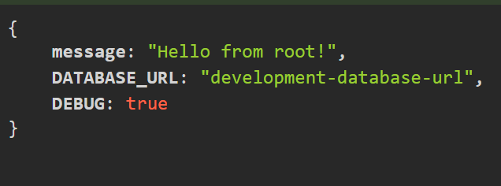

let's add dotenv to our project

```bash
touch .env
```

and a dev.env file

```bash
touch dev.env
```

to add support for env files we have to install serverless-dotenv-plugin

```bash
serverless plugin install -n serverless-dotenv-plugin
```

Example of how to use env variables in serverless.yml

```yaml
service: serverless-node-js-api
frameworkVersion: '3'
useDotenv: true

provider:
  name: aws
  runtime: nodejs20.x
  environment:
    DATABASE_URL: ${env:DATABASE_URL,"fall back value"}

functions:
  api:
    handler: ./src/index.handler
    events:
      - httpApi: '*'

plugins:
  - serverless-offline
  - serverless-dotenv-plugin
```

```javascript
const serverless = require("serverless-http");
const express = require("express");
const app = express();

app.get("/", (req, res, next) => {
  return res.status(200).json({
    message: "Hello from root!",
    DATABASE_URL: process.env.DATABASE_URL || "Not set",
    DEBUG: process.env.DEBUG === `1`,
  });
});

app.get("/path", (req, res, next) => {
  return res.status(200).json({
    message: "Hello from path!",
  });
});

app.use((req, res, next) => {
  return res.status(404).json({
    error: "Not Found",
  });
});

module.exports.handler = serverless(app);
```



Note: values in a env file are always strings
