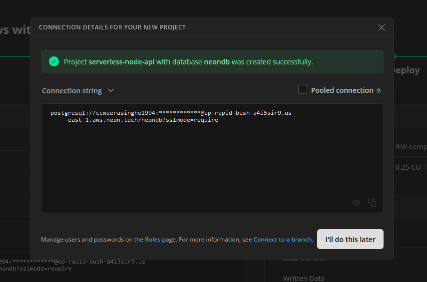
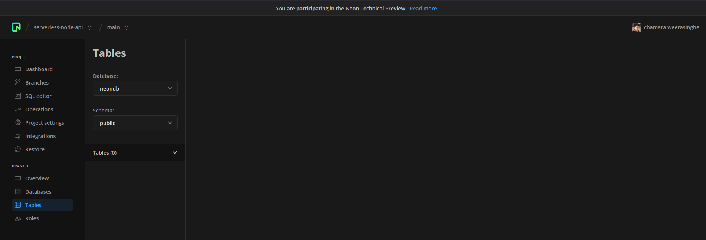
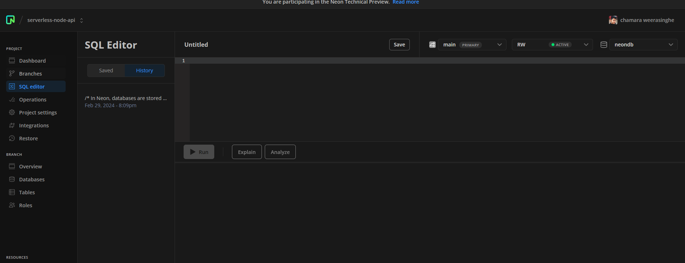
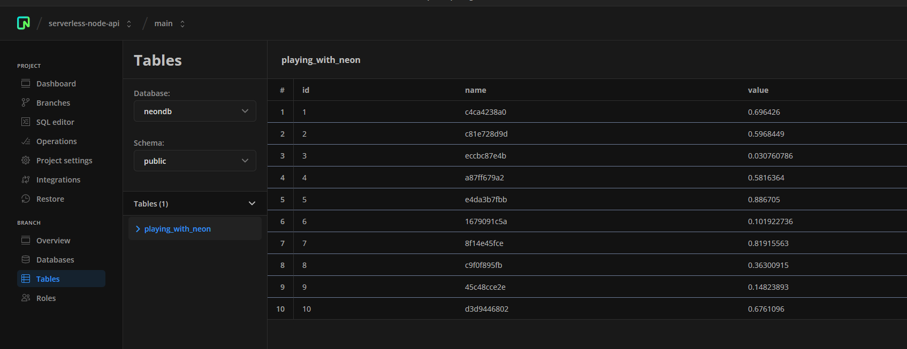
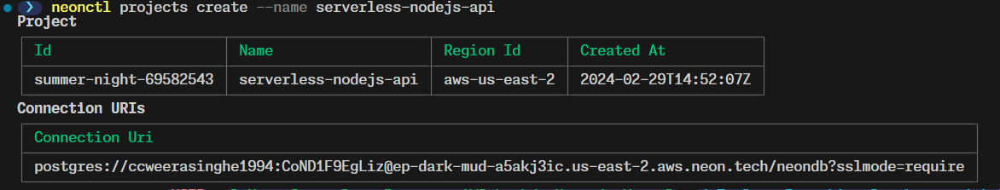
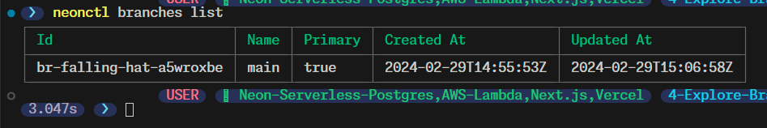
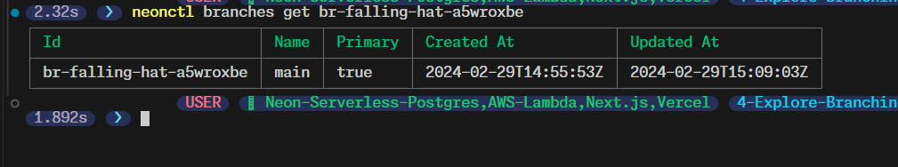

sign up to neon



got to

run the default query



to see created project

```bash
neonctl projects list
```

let's create a new project

```bash
neonctl projects create --name serverless-nodejs-api
```



let's delete the default project

```bash
neonctl projects delete [project_id]
```

to get the connection string

```bash
neonctl connection-string
```

we can get branches

```bash
neonctl branches list
```



to get a specific branch

```bash
neonctl branches get [branch_id]
```



to create a new branch

```bash
neonctl branches create --name main
```

if there are no arguments a random name will be created.

```bash
neonctl branches create
```

to get a connection string of a branch

```bash
neonctl connection-string --branch [branch_id]
```

we can learn more about CLI

<https://neon.tech/docs/reference/neon-cli>
