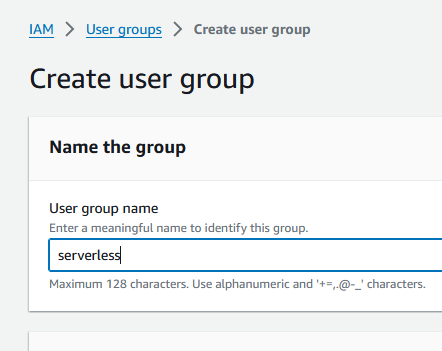

let's exclude the aws keys from the env file


```yml
service: serverless-node-js-api
frameworkVersion: '3'
useDotenv: true

provider:
  name: aws
  runtime: nodejs20.x
  environment:
    DATABASE_URL: ${env:DATABASE_URL,"fall back value"}

functions:
  api:
    handler: ./src/index.handler
    events:
      - httpApi: '*'

custom:
  dotenv:
    exclude:
      - AWS_ACCESS_KEY_ID
      - AWS_SECRET_ACCESS_KEY
      - AWS_SESSION_TOKEN

plugins:
  - serverless-offline
  - serverless-dotenv-plugin
```

now these values won't be added to the state file.