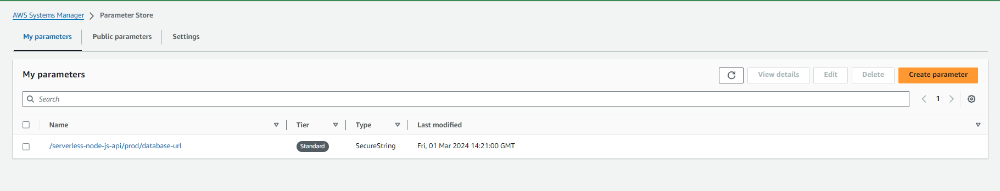
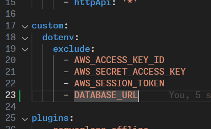
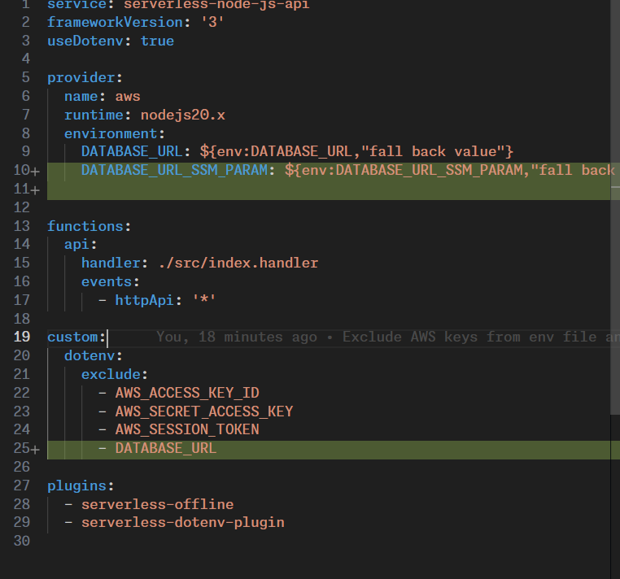

## AWS SSM

add the databse url to aws parameter store


let's exclude the databse url from the env file



let's add the parameter to environment file



let's install aws sdk

```bash
npm install aws-sdk
```

let's add a role for the lambda function to access the parameter store

```yml
service: serverless-node-js-api
frameworkVersion: '3'
useDotenv: true

provider:
  name: aws
  runtime: nodejs20.x
  environment:
    DATABASE_URL_SSM_PARAM: ${env:DATABASE_URL_SSM_PARAM,"fall back value"}
  iam:
    role:
      name: serverless-my-ssm-lambda-role
      statements:
        - Effect: "Allow"
          Resource: "*"
          Action:
            - "ssm:GetParameter"
            - "ssm:GetParameters"
            - "ssm:GetParametersByPath"
            - "ssm:GetParameterHistory"
            - "ssm:DescribeParameters"


functions:
  api:
    handler: ./src/index.handler
    events:
      - httpApi: '*'

custom:
  dotenv:
    exclude:
      - AWS_ACCESS_KEY_ID
      - AWS_SECRET_ACCESS_KEY
      - AWS_SESSION_TOKEN
      - DATABASE_URL
      - AWS_REGION

plugins:
  - serverless-offline
  - serverless-dotenv-plugin
```

let's check the delay

```javascript
const serverless = require("serverless-http");
const express = require("express");
const { neon, neonConfig } = require('@neondatabase/serverless');
const AWS = require('aws-sdk');

const DATABASE_URL_SSM_PARAM = process.env.DATABASE_URL_SSM_PARAM
const AWS_REGION = process.env.AWS_REGION
const app = express();
const ssm = new AWS.SSM({ region: AWS_REGION });
async function dbClient(params) {
  const dbUrl = await ssm.getParameter({ Name: DATABASE_URL_SSM_PARAM, WithDecryption: true }).promise();
  // Enable connection caching
  // This will cache the connection for the duration of the lambda execution
  // non-pooling
  neonConfig.fetchConnectionCache = true;
  return neon(dbUrl.Parameter.Value);
}

app.get("/", async (req, res, next) => {
  const sql = await dbClient();

  const [dbResult] = await sql`select now()`;
  return res.status(200).json({
    message: "Hello from root!",
    result: (Date.now() - dbResult.now.getTime()) / 1000,
  });
});

app.get("/path", (req, res, next) => {
  return res.status(200).json({
    message: "Hello from path!",
  });
});

app.use((req, res, next) => {
  return res.status(404).json({
    error: "Not Found",
  });
});

module.exports.handler = serverless(app);
```

let's simulate the parameter store error

```env
DATABASE_URL_SSM_PARAM="/serverless-node-js-api/prod/database-ur"
```

let's deploy the lambda function

```bash
npm run deploy
```

```bash
2024-03-02T00:32:41.507Z 64f97bc0-aa37-46d1-942e-38e2c84f8f0f ERROR Unhandled Promise Rejection  {
    "errorType": "Runtime.UnhandledPromiseRejection",
    "errorMessage": "ParameterNotFound: null",
    "reason": {
        "errorType": "ParameterNotFound",
        "errorMessage": null,
        "code": "ParameterNotFound",
        "message": null,
        "[__type]": "See error.__type for details.",
        "time": "2024-03-02T00:32:41.504Z",
        "requestId": "6a3c1cd8-140c-4abd-a444-36c0d727ef0c",
        "statusCode": 400,
        "retryable": false,
        "retryDelay": 22.582374521347326,
        "stack": [
            "ParameterNotFound: null",
            "    at Request.extractError (/var/task/node_modules/aws-sdk/lib/protocol/json.js:80:27)",
            "    at Request.callListeners (/var/task/node_modules/aws-sdk/lib/sequential_executor.js:106:20)",
            "    at Request.emit (/var/task/node_modules/aws-sdk/lib/sequential_executor.js:78:10)",
            "    at Request.emit (/var/task/node_modules/aws-sdk/lib/request.js:686:14)",
            "    at Request.transition (/var/task/node_modules/aws-sdk/lib/request.js:22:10)",
            "    at AcceptorStateMachine.runTo (/var/task/node_modules/aws-sdk/lib/state_machine.js:14:12)",
            "    at /var/task/node_modules/aws-sdk/lib/state_machine.js:26:10",
            "    at Request.<anonymous> (/var/task/node_modules/aws-sdk/lib/request.js:38:9)",
            "    at Request.<anonymous> (/var/task/node_modules/aws-sdk/lib/request.js:688:12)",
            "    at Request.callListeners (/var/task/node_modules/aws-sdk/lib/sequential_executor.js:116:18)"
        ]
    },
    "promise": {},
    "stack": [
        "Runtime.UnhandledPromiseRejection: ParameterNotFound: null",
        "    at process.<anonymous> (file:///var/runtime/index.mjs:1276:17)",
        "    at process.emit (node:events:518:28)",
        "    at process.emit (node:domain:488:12)",
        "    at emit (node:internal/process/promises:150:20)",
        "    at processPromiseRejections (node:internal/process/promises:284:27)",
        "    at process.processTicksAndRejections (node:internal/process/task_queues:96:32)"
    ]
}
```
