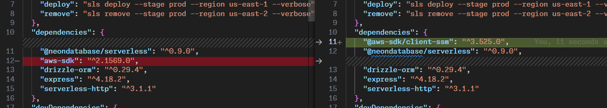
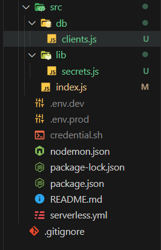

## Decouple and Upgrade AWS SSM Client

let's install aws ssm client

```bash
npm install @aws-sdk/client-ssm
```

let's remove the aws-sdk from the code and replace it with the new client



let's decouple the code and create a new file for the ssm client



```javascript
const { neon, neonConfig } = require('@neondatabase/serverless');
const { getDatabaseUrl } = require("../lib/secrets");

async function getDbClient() {
    const dbUrl = await getDatabaseUrl();
    return neon(dbUrl);
}


module.exports = {
    getDbClient
}
```

```javascript

const { SSMClient, GetParameterCommand } = require("@aws-sdk/client-ssm");

const DATABASE_URL_SSM_PARAM = process.env.DATABASE_URL_SSM_PARAM;

const AWS_REGION = process.env.AWS_REGION;


async function getDatabaseUrl() {
    const client = new SSMClient({ region: AWS_REGION });
    const parameterData = { Name: DATABASE_URL_SSM_PARAM, WithDecryption: true };
    const command = new GetParameterCommand(parameterData);
    const response = await client.send(command);
    return response.Parameter.Value;
}

module.exports = { getDatabaseUrl };
```

```javascript
const serverless = require("serverless-http");
const express = require("express");
const AWS = require('aws-sdk');
const { getDbClient } = require("./db/clients");


const app = express();


app.get("/", async (req, res, next) => {
  const sql = await getDbClient();
  const now = Date.now();
  const [dbResult] = await sql`select now()`;
  return res.status(200).json({
    message: "Hello from root!",
    result: (dbResult.now.getTime() - now) / 1000 + " seconds",
  });
});

app.get("/path", (req, res, next) => {
  return res.status(200).json({
    message: "Hello from path!",
  });
});

app.use((req, res, next) => {
  return res.status(404).json({
    error: "Not Found",
  });
});

module.exports.handler = serverless(app);
```
