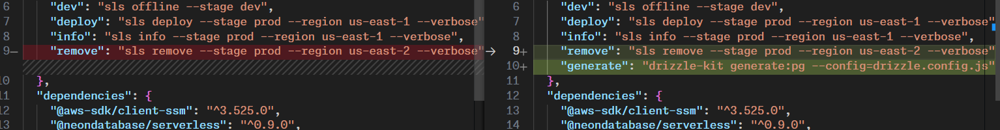
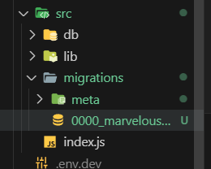

# Generate SQL Migration Files from Drizzle Kit

let's create a file `drizzle.config.js` in the root of the project and add the following code:

```javascript
const e = require("express");

const config = {
    schema: "./src/db/schemas.js",
    out: './src/migrations',
};

export default config;
```



let's run the migration command:

```bash
npm run migrate
```



```sql
CREATE TABLE IF NOT EXISTS "leads" (
 "id" serial PRIMARY KEY NOT NULL,
 "email" text NOT NULL,
 "description" text DEFAULT 'this is a place holder description',
 "created_at" timestamp DEFAULT now()
);
```
